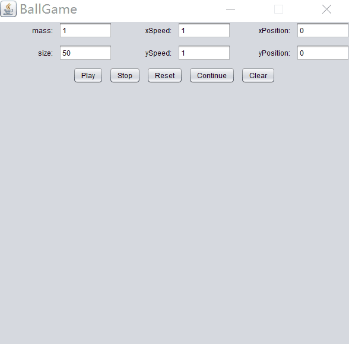

目录
=================
* [Acknowledgement](#Acknowledgement)
* [Game Demo](#game-demo)
* [The Basic Ideas](#the-basic-idea)
	* [The Ball Class](#the-ball-class)
	* [Event Listener](#event-listener)
	* [GUI Framework](#gui-framework)
         
# Balls' collision By Java GUI
[](https://github.com/Hephaest/BallGame/blob/master/LICENSE)
[](https://www.oracle.com/technetwork/java/javase/8u202-relnotes-5209339.html)
[](https://github.com/Hephaest/BallGame/tree/master/src)

English | [中文](README_CN.md)

Last updated on `2019/07/06`

Bug fixes:
- Error input without warning
- Graphic overlap issues
- High-speed ball out of bounds

# Acknowledgement
Thanks to Elaine! She inspired me by her original ball game code. 
<p>I rewrote and enhanced her code to make GUI more customized and reasonable. 
<p>You can visit her website at: https://zhuanlan.zhihu.com/p/28179980.
<p> My code focus on the specific speed, direction and color. As for GUI, I added buttons to control the balls movements.
 
# Game Demo
<p align="center"></p>

# The Basic Ideas
To achieve ball movements, the following attributes are important:

**1. What are the specific characteristics of a ball?**<br>
Mass is under consideration due to kinetic energy theorem, besides, it also has its direction, size, location and current speed.<br>
**2. Who can initialize the state of the ball?**<br>
There are 2 states:(random) default value, manual manual input.<br>
**3. Who can control the movement of the ball?**<br>
A ball should follow a certain instruction, simple as a mouse click. in addition, a more complicated instructions can be achieved by using buttons.<br>

According to above analysis, we can create several class: a ball class to describe the state of the ball, a class to control all commands, including a window and options. We can divide the functionality of these into three classes:

### The Ball Class ###
Because the window is two-dimensional, the constructor only needs to include:`mass, the x, y speed, the position represented by the two-dimensional coordinates, color, size, current board`.<br>
The external attribution：`color, size`.<br>
The movement of the ball:<br>
- Bound the border directly
- The distance is calculated using the formula: distance = current distance + speed × time (simplify as 1)
- Full elastic collision formula between balls：
     和 
    
- Try not to overlap the shapes of balls. 

Code show as below:
```java
/**
 * This class is aimed to declare a ball and the method of moving, collision,draw and clear it
 * @author Hephaest
 * @version 2019/7/5
 * @since jdk_1.8.202
 */
import java.awt.Color;
import java.awt.Graphics;
import java.util.ArrayList;

public class Ball{

	/**
	 * declare variables of ball
	 */
	private int xPos, yPos, size, xSpeed, ySpeed,mass;
	private Color color;
	private BallFrame bf;

	/**
	 * Constructor for objects of class Ball
	 * @param xPos the x position of the ball.
	 * @param yPos the y position of the ball.
	 * @param size the size of the ball.
	 * @param xSpeed the x speed of the ball.
	 * @param ySpeed the y speed of the ball.
	 * @param color the color of the ball.
	 * @param mass the mass of the ball.
	 * @param bf the instance of the BallFrame.
	 */
	public Ball(int xPos, int yPos, int size, int xSpeed, int ySpeed, Color color, int mass, BallFrame bf) {
		super();
		this.xPos = xPos;
		this.yPos = yPos;
		this.size = size;
		this.xSpeed = xSpeed;
		this.ySpeed = ySpeed;
		this.color = color;
		this.mass = mass;
		this.bf = bf;
	}

	/**
	 * use method of Graphics to create a colorful ball
	 * @param g A ball
	 */
	public void drawBall(Graphics g) {
		if(xPos + size> bf.getWidth() - 4) xPos = bf.getWidth() - size - 4;
		else if(xPos < 4) xPos = 4;
		if(yPos < 4) yPos = 4;
		else if(yPos > bf.getHeight()) yPos = bf.getHeight() - size - 4;
		g.setColor(color);		
		g.fillOval(xPos, yPos, size, size);	
	}

	/**
	 * This method tries to figure out
	 * if ball is going to hit the boundary,change its direction
	 * @param bf the instance of the BallFrame.
	 */
	public void moveBall(BallFrame bf) {
		if (xPos + size + xSpeed > bf.getWidth() - 4 || xPos + xSpeed < 4)
		{
			xSpeed = -xSpeed;
		}
		if (yPos + ySpeed < 2 || yPos + size + ySpeed > bf.getHeight() - 163)
		{
			ySpeed = - ySpeed;
		}
		xPos += xSpeed;		
		yPos += ySpeed;

	}

	/**
	 * This method is used to figure out whether collision could happen.
	 * And Try not to overlap balls.
	 * @param balls whole balls.
	 */
	public void collision(ArrayList<Ball> balls) {
		for (int i = 0; i < balls.size(); i++) {
			Ball ball = balls.get(i);
			if (ball != this) {		
				double d1 = Math.abs(this.xPos - ball.xPos);	
				double d2 = Math.abs(this.yPos - ball.yPos);	
				double d3 = Math.sqrt(Math.pow(d1,2) + Math.pow(d2,2));	
				if (d3 <= (this.size / 2 + ball.size / 2)) {
					if (this.xPos > ball.xPos) {
						xPos++;
						while(Math.sqrt(Math.pow(this.xPos - ball.xPos,2) + Math.pow(d2,2)) < this.size / 2 + ball.size / 2) xPos++;
					} else {
						ball.xPos++;
						while(Math.sqrt(Math.pow(ball.xPos - this.xPos,2) + Math.pow(d2,2)) < this.size / 2 + ball.size / 2) ball.xPos++;
					}

					/* Using perfectly elastic collision */
					this.xSpeed=((this.mass - ball.mass) * this.xSpeed + 2 * ball.mass * ball.xSpeed)/(this.mass + ball.mass);
					this.ySpeed=((this.mass - ball.mass) * this.ySpeed + 2 * ball.mass * ball.ySpeed)/(this.mass + ball.mass);
					ball.xSpeed=((ball.mass - this.mass) * ball.xSpeed + 2 * this.mass * this.xSpeed)/(this.mass + ball.mass);
					ball.ySpeed=((ball.mass - this.mass) * ball.ySpeed + 2 * this.mass * this.ySpeed)/(this.mass + ball.mass);
				}
			}
		}

	}

}
```
### Event Listener
- The constructor needs to introduce classes that involve text boxes, buttons, and balls.
- Click the mouse, generate a random colored ball in addition to the size given.
- Click`Play`, the specified ball is generated.
- Click `Stop` ball then stop moving but does not disappear.
- Click `Reset`, the user can choose to re-enter.
- Click `Continue` then the game can continue.
- Click `Clear` ball then stop moving and the thread is interrupted immediately.

Code show as below:
```java
/**
 * This class is aimed to receive event from clicking in BallFrame GUI.
 * you can generate a ball by clicking mouse or click responding button ("Play").  
 * @author Hephaest
 * @version 2019/7/5
 * @since jdk_1.8.202
 */
import java.awt.Color;
import java.awt.event.ActionEvent;
import java.awt.event.ActionListener;
import java.awt.event.MouseAdapter;
import java.awt.event.MouseEvent;
import java.util.ArrayList;
import java.util.Random;
import java.util.regex.Pattern;

import javax.swing.*;

public class Listener extends MouseAdapter implements ActionListener,Runnable {
	/**
	 * declare variables of Listener
	 * We must decide when should change the boolean value of clearFlag and pauseFlag. 
	 */
	private BallFrame bf;
	private Random rand = new Random();
	private volatile boolean clearFlag = false, pauseFlag = false;
	private ArrayList<Ball> ball;
	Thread playing;

	/**
	 * Constructor for objects of class Listener
	 * Not only should we control JTextField and JButton in BallFrame, but also numbers of all.
	 * @param bf the instance of the BallFrame.
	 * @param ball the balls.
	 */
	public Listener(BallFrame bf, ArrayList ball) {
		this.bf = bf;
		this.ball = ball;
	}

	/**
	 * I perfer to call this method as "naughty mouse"
	 * each time we click our mouse,we don't know the exact information of such ball because of random choice.
	 */
	public void mousePressed(MouseEvent e) {
		int x = e.getX();	
		int y = e.getY();
		if(x + 50 > bf.getWidth() - 4) x = bf.getWidth() - 54;
		else if(x < 4) x = 4;
		if(y < 163) y = 163;
		else if(y + 50 > bf.getHeight()) y = bf.getHeight() - 46;
		Ball newBall = new Ball(x, y - 163, 50, (1 + rand.nextInt(9) * (Math.random() > 0.5 ? 1 : -1)),
				(1 + rand.nextInt(9) * (Math.random() > 0.5? 1 : -1)),
				new Color(rand.nextInt(255),rand.nextInt(255), rand.nextInt(255)),rand.nextInt(9) + 1, bf);
		ball.add(newBall);
	}

	@Override
	/**
	 * This method is from Runnable
	 * Don't change clearFlag easily! 
	 * if the condition of while loop is false, everything stops!
	 */
	public void run() {
		while (!clearFlag) {
			if(!pauseFlag)
			{
				bf.repaint();
				try {
					Thread.sleep(30);
				} catch (InterruptedException e) {
					e.printStackTrace();
				}
			}
		}
	}
			
	/**
	 * This method is used to make a respond to a button.
	 */
	public void actionPerformed(ActionEvent event) {
        String command = event.getActionCommand();
        if (command.equals("Play")) {
			if (checkValid(bf.massText.getText(), bf.sizeText.getText(), bf.xPositionText.getText(), bf.yPositionText.getText())) {
				startPlaying();
			} else {
				JOptionPane.showMessageDialog(null, "Please enter correct numbers!");
			}
		}
        if (command.equals("Stop")) {
            stopPlaying();
        }
        if (command.equals("Reset")) {
            setAllFields();
        }
        if (command.equals("Continue")) {
            continuePlaying();
        }
        if (command.equals("Clear")) {
            clearPlaying();
        }
    }

    /**
	 * This method is used to make a respond to "Reset".
	 * Every text field will be set as default.
	 * And user cannot click "Reset" again or "Continue".
	 */
	void setAllFields() {
		bf.massText.setText("1");
		bf.xSpeedText.setText("1");
		bf.xPositionText.setText("0");
		bf.sizeText.setText("50");
		bf.ySpeedText.setText("1");
		bf.yPositionText.setText("0");
		bf.reset.setEnabled(false);
		bf.play.setEnabled(true);
		bf.Continue.setEnabled(false);
		bf.clear.setEnabled(true);
    }

    /**
	 * This method is used to make a respond to "Play".
	 * we create a new thread and let clearFlag is false, which means run() can run.
	 * we need to convert Jpanel into int. Then we could use Ball class to define each ball.
	 * And user cannot click "play" again or "Continue".
	 */
	void startPlaying() {   
        playing = new Thread(this);
        playing.start();
        clearFlag = false;
        bf.play.setEnabled(false);
        bf.Continue.setEnabled(false);
        bf.stop.setEnabled(true);
        bf.reset.setEnabled(true);
        bf.clear.setEnabled(true);
        String xP = bf.xPositionText.getText();
        int x = Integer.parseInt(xP);
        String yP = bf.yPositionText.getText();
        int y = Integer.parseInt(yP);
        String Size = bf.sizeText.getText();
        int size = Integer.parseInt(Size);
        String Xspeed = bf.xSpeedText.getText();
        int xspeed = Integer.parseInt(Xspeed);
        String Yspeed = bf.ySpeedText.getText();
        int yspeed = Integer.parseInt(Yspeed);
        String Mass = bf.massText.getText();
        int mass = Integer.parseInt(Mass);
        Ball myball = new Ball(x, y, size, xspeed,yspeed, 
				new Color(rand.nextInt(255), rand.nextInt(255), rand.nextInt(255)), mass, bf);
		ball.add(myball);
    }

    /**
	 * This method is used to make a respond to "Stop".
	 * It seems all ball stop but this isn't caused by thread, we just do not repaint.
	 * And user cannot click "Stop" again.
	 */
    void stopPlaying() {
        bf.stop.setEnabled(false);
        bf.play.setEnabled(true);
        bf.reset.setEnabled(true);
        bf.Continue.setEnabled(true);
        bf.clear.setEnabled(true);
        pauseFlag=true;
    }

    /**
	 * This method is used to make a respond to "Continue".
	 * we change the value of pauseFlag in order to repaint window again and again.
	 * we should remember that our thread "Playing" still working!
	 * And user cannot click "Continue" again.
	 */
    void continuePlaying()
    {
    	bf.stop.setEnabled(true);
        bf.play.setEnabled(true);
        bf.reset.setEnabled(true);
        bf.Continue.setEnabled(false);
        bf.clear.setEnabled(true);
        pauseFlag = false;
    }

    /**
	 * This method is used to make a respond to "Clear".
	 * In this time, I suggest that our thread should be declare as null to decrease waste space of CPU.
	 * The previous step is not enough to draw a blank window, the next step is to clear all ball and repaint.
	 * And user cannot click "Clear" again, "Stop" and "Continue".
	 */
    void clearPlaying()
    {
    	bf.clear.setEnabled(false);
    	bf.stop.setEnabled(false);
        bf.play.setEnabled(true);
        bf.reset.setEnabled(true);
        bf.Continue.setEnabled(false);
        playing = null;
        clearFlag = true;
        ball.clear();
        bf.repaint();
    }

	/**
	 * Check whether user's inputs from the text fields are all valid.
	 * @param mass the mass of the ball.
	 * @param size the size of the ball.
	 * @param xPos the x position of the ball.
	 * @param yPos the y position of the ball.
	 * @return a boolean value of the check result.
	 */
	private boolean checkValid(String mass, String size, String xPos, String yPos)
	{
		Pattern pattern = Pattern.compile("[0-9]*");
		if (!pattern.matcher(mass).matches() || !pattern.matcher(size).matches() || !pattern.matcher(xPos).matches() || !pattern.matcher(yPos).matches())
			return false;
		else if (Integer.parseInt(mass) <= 0 || Integer.parseInt(size) <= 0 || Integer.parseInt(xPos) < 0 || Integer.parseInt(yPos) < 0)
			return false;
		else
			return true;
	}
}
```

### GUI Framework
- Requires text box to implement inpute.
- Requires 5 buttons representing `Play`, `Stop`, `Reset`, `Continue`, `Clear`.
- Create a canvas to show the animation of the ball.

Code show as below:
```java
/**
 * This class mainly use functions of GUI combined some knowledge about Graphics.
 * @author Hephaest
 * @version 2019/7/5
 * @since jdk_1.8.202
 */
import java.awt.FlowLayout;
import java.awt.Graphics;
import java.awt.Graphics2D;
import java.awt.GridLayout;
import java.awt.Image;
import java.awt.RenderingHints;
import java.util.ArrayList;

import javax.swing.JButton;
import javax.swing.JFrame;
import javax.swing.JLabel;
import javax.swing.JPanel;
import javax.swing.JTextField;
import javax.swing.UIManager;

public class BallFrame extends JFrame {
	private ArrayList<Ball> ball = new ArrayList<Ball>(); 
	private Image img;
	private Graphics2D graph;

	/**
	 * JPanel helps us create text fields and buttons row by row.
	 */
    JPanel row1 = new JPanel();
    JLabel mass = new JLabel("mass:", JLabel.RIGHT);
    JTextField massText, xSpeedText, xPositionText, sizeText, ySpeedText, yPositionText;
    JLabel xSpeed = new JLabel("xSpeed:", JLabel.RIGHT);
    JLabel xPosition = new JLabel("xPosition:", JLabel.RIGHT);
    JLabel size = new JLabel("size:", JLabel.RIGHT);
    JLabel ySpeed = new JLabel("ySpeed:", JLabel.RIGHT);
    JLabel yPosition = new JLabel("yPosition:", JLabel.RIGHT);

    JPanel row2 = new JPanel();
    JButton stop = new JButton("Stop");
    JButton Continue = new JButton("Continue");
    JButton clear = new JButton("Clear");
    JButton play = new JButton("Play");
    JButton reset = new JButton("Reset");

	/**
	 * Constructor for objects of class BallFrame
	 */
	public BallFrame()
    {
    	super("BallGame");
    	setSize(600, 600);
    	setDefaultCloseOperation(JFrame.EXIT_ON_CLOSE);

    	//specify how many text fields should be filled in one line.
    	row1.setLayout(new GridLayout(2, 3, 10, 10));

    	// the following process is to add them into window
    	row1.add(mass);
    	massText = new JTextField("1");
    	row1.add(massText);
    	row1.add(xSpeed);
    	xSpeedText = new JTextField("1");
    	row1.add(xSpeedText);
    	row1.add(xPosition);
    	xPositionText = new JTextField("0");
    	row1.add(xPositionText);
    	row1.add(size);
    	sizeText = new JTextField("50");
    	row1.add(sizeText);
    	row1.add(ySpeed);
    	ySpeedText = new JTextField("1");
    	row1.add(ySpeedText);
    	row1.add(yPosition);
    	yPositionText = new JTextField("0");
    	row1.add(yPositionText);
    	add(row1,"North");

    	//make buttons in the center
        FlowLayout layout3 = new FlowLayout(FlowLayout.CENTER, 10, 10);
        row2.setLayout(layout3);
        row2.add(play);
        row2.add(stop);
        row2.add(reset);
        row2.add(Continue);
        row2.add(clear);
        add(row2);
        
        setResizable(false);
    	setVisible(true);
    }

    //Main function, nothing else need to explain...
	public static void main(String[] args) {
		BallFrame.setLookAndFeel();
		BallFrame bf = new BallFrame();
		bf.UI();
	}

	/**
	 * Add listeners.
	 */
	public void UI() {	    	                   
		Listener lis = new Listener(this, ball);
		this.addMouseListener(lis);	
		clear.addActionListener(lis);
		Continue.addActionListener(lis);
    	stop.addActionListener(lis);
        play.addActionListener(lis);
        reset.addActionListener(lis);
		Thread current = new Thread(lis);     
		current.start();						

	}

	/**
	 * This method is to ensure across operation system could have an ability to show window
	 */
    private static void setLookAndFeel() {
        try {
            UIManager.setLookAndFeel(
                "com.sun.java.swing.plaf.nimbus.NimbusLookAndFeel"
            );
        } catch (Exception exc) {
            // ignore error
        }
    }

    /**
	 * This method is used to help us create a canvas.
	 */
	public void paint(Graphics g) {
		// Need to repaint!
		row1.repaint(0,0,this.getWidth(), 80);
		row2.repaint(0,0,this.getWidth(), 42);
		img = this.createImage(this.getWidth(), this.getHeight());
		graph = (Graphics2D)img.getGraphics();
		//Anti-aliasing,make ball look more smooth
		graph.setRenderingHint(RenderingHints.KEY_ANTIALIASING, RenderingHints.VALUE_ANTIALIAS_ON);
		graph.setBackground(getBackground());
		//for each ball, do the same process, after collision we'd better whether it's going to hit boundary or not.
		for (int i = 0; i < ball.size(); i++) {
			Ball myBall = ball.get(i);
			myBall.drawBall(graph);
			myBall.collision(ball);
			myBall.moveBall(this);
		}
		//If the canvas's height over 160, it will hide our buttons.
		g.drawImage(img, 0, 150, this);
	}
	
}
```
