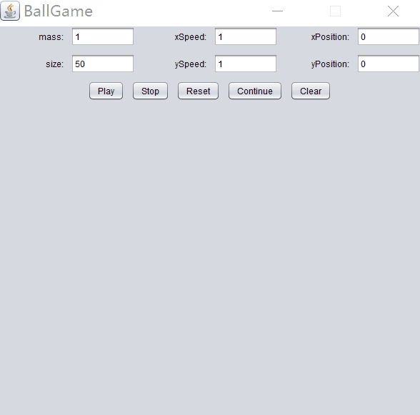

Table of Contents
=================
* [感谢](#感谢)
* [效果图](#效果图)
* [基本思路](#基本思路)
   * [球类](#球类)
   * [事件监听器](#事件监听器)
   * [GUI框架](#gui框架)
         
# Java 实现小球碰撞GUI
[](https://github.com/Hephaest/BallGame/blob/master/LICENSE)
[](https://www.oracle.com/technetwork/java/javase/8u202-relnotes-5209339.html)
[](https://github.com/Hephaest/BallGame/tree/master/src)

中文 | [English](README.md)

最后一次更新于`2019/07/06`
修复问题:
- 错误输入未提醒问题
- 碰撞小球的图形重叠问题
- 高速小球越界问题

## 感谢 ##
大一暑假拜读学姐的一篇文章：[我说这是一篇很严肃的技术文章你信吗](https://zhuanlan.zhihu.com/p/28179980)，本篇在她的基础上加以改进。

## 效果图 ##
<p align="center"></p>

## 基本思路 ##
要实现小球运动，可以从以下几点切入：

**1. 小球都有那些具体特征?**<br>  
涉及动能定理就需要考虑质量了，除此之外常规的几个变量也不能忘：方向、球的尺寸，所在位置以及当前速度。<br>
**2. 谁能初始小球的状态？**<br>
小球的状态无非两种：(随机)默认值、人工手动输入。<br>
**3. 谁能控制小球的运动？**<br>
我们控制小球是需要给予一定的指令的，就算是鼠标点击也是简单的指令之一，除此之外如果想要拥有稍微复杂一点的指令可以使用按钮来实现。<br>

根据分析，我们大概能构造出大概的类，无非是一个专门描述小球状态的，一个控制所有命令的，一个构建出窗口和选项的。我们还可以在细化这三个类的功能：

### 球类 ###
因为窗口也是二维的，构造方法仅需要包含：`质量，沿x、y轴的分速度，二维坐标表示的位置，颜色，大小, 所在的画板`。<br>
小球的外在属性：`颜色，尺寸`。<br>
小球的移动情况:<br>
- 遇到边界直接反弹
- 移动距离利用公式：距离 = 当前距离 + 速度 × 时间(这边直接简化成1)
- 小球之间的完全弹性碰撞公式：
     和 
    
- 碰撞的两球形状尽量不要重叠,当程序检测到这种意外时要尽可能拉开两球之间的距离，直到两球距离恰好等于两球半径之和。


代码如下：
```java
/**
 * 这个类主要是用来设置小球的各种属性以及运动关系。
 * @author Hephaest
 * @version 2019/7/5
 * @since jdk_1.8.202
 */
import java.awt.Color;
import java.awt.Graphics;
import java.util.ArrayList;

public class Ball{

	/**
	 * 声明小球的各种变量。
	 */
	private int xPos, yPos, size, xSpeed, ySpeed,mass;
	private Color color;
	private BallFrame bf;

	/**
	 * 球类的构造函数。
	 * @param xPos 小球在X轴上的位置。
	 * @param yPos 小球在Y轴上的位置。
	 * @param size 小球的直径长度。
	 * @param xSpeed 小球在X轴上的分速度。
	 * @param ySpeed 小球在Y轴上的分速度。
	 * @param color 小球的颜色。
	 * @param mass 小球的质量。
	 * @param bf 当前小球所在的画板。
	 */
	public Ball(int xPos, int yPos, int size, int xSpeed, int ySpeed, Color color, int mass, BallFrame bf) {
		super();
		this.xPos = xPos;
		this.yPos = yPos;
		this.size = size;
		this.xSpeed = xSpeed;
		this.ySpeed = ySpeed;
		this.color = color;
		this.mass = mass;
		this.bf = bf;
	}

	/**
	 * 在画板上绘制小球。
	 * @param g 当前小球。
	 */
	public void drawBall(Graphics g) {
		if(xPos + size> bf.getWidth() - 4) xPos = bf.getWidth() - size - 4;
		else if(xPos < 4) xPos = 4;
		if(yPos < 4) yPos = 4;
		else if(yPos > bf.getHeight()) yPos = bf.getHeight() - size - 4;
		g.setColor(color);		
		g.fillOval(xPos, yPos, size, size);	
	}

	/**
	 * 该方法是用来判断下一秒小球的移动方向并计算当前小球的位置。
	 * @param bf 当前小球所在的画板。
	 */
	public void moveBall(BallFrame bf) {
		if (xPos + size + xSpeed > bf.getWidth() - 4 || xPos + xSpeed < 4)
		{
			xSpeed = -xSpeed;
		}
		if (yPos + ySpeed < 2 || yPos + size + ySpeed > bf.getHeight() - 163)
		{
			ySpeed = - ySpeed;
		}
		xPos += xSpeed;		
		yPos += ySpeed;

	}
    
    /**
	 * 该方法是用于判断碰撞是否发生了，如果发生了，尽量避免小球形状之间的重叠。
	 * @param balls 所有小球。
	 */
	public void collision(ArrayList<Ball> balls) {
		for (int i = 0; i < balls.size(); i++) {
			Ball ball = balls.get(i);
			if (ball != this) {		
				double d1 = Math.abs(this.xPos - ball.xPos);	
				double d2 = Math.abs(this.yPos - ball.yPos);	
				double d3 = Math.sqrt(Math.pow(d1,2) + Math.pow(d2,2));	
				if (d3 <= (this.size / 2 + ball.size / 2)) {
					if (this.xPos > ball.xPos) {
						xPos++;
						while(Math.sqrt(Math.pow(this.xPos - ball.xPos,2) + Math.pow(d2,2)) < this.size / 2 + ball.size / 2) xPos++;
					} else {
						ball.xPos++;
						while(Math.sqrt(Math.pow(ball.xPos - this.xPos,2) + Math.pow(d2,2)) < this.size / 2 + ball.size / 2) ball.xPos++;
					}

					/* 应用完美弹性碰撞的速度公式 */
					this.xSpeed=((this.mass - ball.mass) * this.xSpeed + 2 * ball.mass * ball.xSpeed)/(this.mass + ball.mass);
					this.ySpeed=((this.mass - ball.mass) * this.ySpeed + 2 * ball.mass * ball.ySpeed)/(this.mass + ball.mass);
					ball.xSpeed=((ball.mass - this.mass) * ball.xSpeed + 2 * this.mass * this.xSpeed)/(this.mass + ball.mass);
					ball.ySpeed=((ball.mass - this.mass) * ball.ySpeed + 2 * this.mass * this.ySpeed)/(this.mass + ball.mass);
				}
			}
		}

	}

}
```

### 事件监听器 ###
- 构造方法中需要同时引入涉及文本框、按钮和小球所在的类。
- 如果点击鼠标，生成一个除了大小给定其他随机的彩色小球。
- 如果点 `Play` 文本框的信息被读取，生成指定的小球。
- 如果点 `Stop` 小球停止运动但不消失。
- 如果点 `Reset` 文本框恢复默认值，用户可以选择重新输入。
- 如果点 `Continue` 小球继续刚刚的运动。
- 如果点 `Clear` 小球停止运动且线程立即中断。

代码如下：
```java
/**
 * 此类是用于监听 BallFrame GUI 的文字输入和按监听的。
 * 用户可以输入参数然后点击按钮"Play"或者在画板中指定区域单机鼠标生成小球。  
 * @author Hephaest
 * @version 2019/7/5
 * @since jdk_1.8.202
 */
import java.awt.Color;
import java.awt.event.ActionEvent;
import java.awt.event.ActionListener;
import java.awt.event.MouseAdapter;
import java.awt.event.MouseEvent;
import java.util.ArrayList;
import java.util.Random;
import java.util.regex.Pattern;

import javax.swing.*;

public class Listener extends MouseAdapter implements ActionListener,Runnable {
	/**
	 * 声明监听器里的所有变量。
	 * 需要注意何时更改 clearFlag 和 pauseFlag 的布尔值。 
	 */
	private BallFrame bf;
	private Random rand = new Random();
	private volatile boolean clearFlag = false, pauseFlag = false;
	private ArrayList<Ball> ball;
	Thread playing;

	/**
	 * 监听器的构造函数。
	 * @param bf BallFrame 类的实例。
	 * @param ball 所有小球组成的列表。
	 */
	public Listener(BallFrame bf, ArrayList ball) {
		this.bf = bf;
		this.ball = ball;
	}

	/**
	 * 每次点击小球时，只能直到生成小球的初始位置，但是它的速度分量都是随机数。
	 */
	public void mousePressed(MouseEvent e) {
		int x = e.getX();	
		int y = e.getY();
		if(x + 50 > bf.getWidth() - 4) x = bf.getWidth() - 54;
		else if(x < 4) x = 4;
		if(y < 163) y = 163;
		else if(y + 50 > bf.getHeight()) y = bf.getHeight() - 46;
		Ball newBall = new Ball(x, y - 163, 50, (1 + rand.nextInt(9) * (Math.random() > 0.5 ? 1 : -1)),
				(1 + rand.nextInt(9) * (Math.random() > 0.5? 1 : -1)),
				new Color(rand.nextInt(255),rand.nextInt(255), rand.nextInt(255)),rand.nextInt(9) + 1, bf);
		ball.add(newBall);
	}

	@Override
	/**
	 * 该方法是 Runnable 的重写。 
	 * 如果用户选择暂停的话，需要停止画板刷新和新的绘制。
	 */
	public void run() {
		while (!clearFlag) {
			if(!pauseFlag)
			{
				bf.repaint();
				try {
					Thread.sleep(30);
				} catch (InterruptedException e) {
					e.printStackTrace();
				}
			}
		}
	}
			
	/**
	 * 该方法用来响应不同按钮的需求。
	 */
	public void actionPerformed(ActionEvent event) {
        String command = event.getActionCommand();
        if (command.equals("Play")) {
			if (checkValid(bf.massText.getText(), bf.sizeText.getText(), bf.xPositionText.getText(), bf.yPositionText.getText())) {
				startPlaying();
			} else {
				JOptionPane.showMessageDialog(null, "Please enter correct numbers!");
			}
		}
        if (command.equals("Stop")) {
            stopPlaying();
        }
        if (command.equals("Reset")) {
            setAllFields();
        }
        if (command.equals("Continue")) {
            continuePlaying();
        }
        if (command.equals("Clear")) {
            clearPlaying();
        }
    }

    /**
	 * 该方法用来响应 "Reset" 按钮。
	 * 每个文本框都设置默认值。
	 * 重置完后无法再点击 "Reset" 或 "Continue"。
	 */
	void setAllFields() {
		bf.massText.setText("1");
		bf.xSpeedText.setText("1");
		bf.xPositionText.setText("0");
		bf.sizeText.setText("50");
		bf.ySpeedText.setText("1");
		bf.yPositionText.setText("0");
		bf.reset.setEnabled(false);
		bf.play.setEnabled(true);
		bf.Continue.setEnabled(false);
		bf.clear.setEnabled(true);
    }

    /**
	 * 该方法用来响应 "Play" 按钮。
	 * 需要创建一个新的进程并设置 clearFlag 为 false, 这样 run() 函数可以正常运行。
	 * 运行完后无法再点击 "play" again 或 "Continue"。
	 */
	void startPlaying() {   
        playing = new Thread(this);
        playing.start();
        clearFlag = false;
        bf.play.setEnabled(false);
        bf.Continue.setEnabled(false);
        bf.stop.setEnabled(true);
        bf.reset.setEnabled(true);
        bf.clear.setEnabled(true);
        String xP = bf.xPositionText.getText();
        int x = Integer.parseInt(xP);
        String yP = bf.yPositionText.getText();
        int y = Integer.parseInt(yP);
        String Size = bf.sizeText.getText();
        int size = Integer.parseInt(Size);
        String Xspeed = bf.xSpeedText.getText();
        int xspeed = Integer.parseInt(Xspeed);
        String Yspeed = bf.ySpeedText.getText();
        int yspeed = Integer.parseInt(Yspeed);
        String Mass = bf.massText.getText();
        int mass = Integer.parseInt(Mass);
        Ball myball = new Ball(x, y, size, xspeed,yspeed, 
				new Color(rand.nextInt(255), rand.nextInt(255), rand.nextInt(255)), mass, bf);
		ball.add(myball);
    }

    /**
	 * 该方法用来响应 "Stop" 按钮。
	 * 这个不需要重新绘制。
	 * 用户无法再点击 "Stop" 按钮。
	 */
    void stopPlaying() {
        bf.stop.setEnabled(false);
        bf.play.setEnabled(true);
        bf.reset.setEnabled(true);
        bf.Continue.setEnabled(true);
        bf.clear.setEnabled(true);
        pauseFlag=true;
    }

    /**
	 * 该方法用来响应 "Continue" 按钮。
	 * 需要设置 pauseFlag 的值用来一遍又一遍地重绘窗口。
	 * 需要记住线程 "Playing" 仍在工作!
	 * 用户无法再点击 "Continue" 按钮。
	 */
    void continuePlaying()
    {
    	bf.stop.setEnabled(true);
        bf.play.setEnabled(true);
        bf.reset.setEnabled(true);
        bf.Continue.setEnabled(false);
        bf.clear.setEnabled(true);
        pauseFlag = false;
    }

    /**
	 * 该方法用来响应 "Clear" 按钮。
	 * 通过将线程声明为null来减少CPU的浪费。
	 * 需要清空所有小球并重新绘制。
	 * 用户无法再点击 "Clear" 或 "Stop" 或 "Continue" 按钮。
	 */
    void clearPlaying()
    {
    	bf.clear.setEnabled(false);
    	bf.stop.setEnabled(false);
        bf.play.setEnabled(true);
        bf.reset.setEnabled(true);
        bf.Continue.setEnabled(false);
        playing = null;
        clearFlag = true;
        ball.clear();
        bf.repaint();
    }

	/**
	 * 核查用户在文本框里的输入是否正确。
	 * @param mass 小球的质量。
	 * @param size 小球的直径。
	 * @param xPos 小球在X轴的位置。
	 * @param yPos 小球在Y轴的位置。
	 * @return 返回核验结果。
	 */
	private boolean checkValid(String mass, String size, String xPos, String yPos)
	{
		Pattern pattern = Pattern.compile("[0-9]*");
		if (!pattern.matcher(mass).matches() || !pattern.matcher(size).matches() || !pattern.matcher(xPos).matches() || !pattern.matcher(yPos).matches())
			return false;
		else if (Integer.parseInt(mass) <= 0 || Integer.parseInt(size) <= 0 || Integer.parseInt(xPos) < 0 || Integer.parseInt(yPos) < 0)
			return false;
		else
			return true;
	}
}
```

### GUI框架 ##
- 需要文本框实现输入，两行，每行3个变量。
- 需要5个按钮，分别代表 `Play`、`Stop`、`Reset`、`Continue`、`Clear`。
- 需要一个画布，可以显示出球类的动画。

代码如下
```java
/**
 * 该类主要用于绘制GUI。
 * @author Hephaest
 * @version 2019/7/5
 * @since jdk_1.8.202
 */
import java.awt.FlowLayout;
import java.awt.Graphics;
import java.awt.Graphics2D;
import java.awt.GridLayout;
import java.awt.Image;
import java.awt.RenderingHints;
import java.util.ArrayList;

import javax.swing.JButton;
import javax.swing.JFrame;
import javax.swing.JLabel;
import javax.swing.JPanel;
import javax.swing.JTextField;
import javax.swing.UIManager;

public class BallFrame extends JFrame {
	private ArrayList<Ball> ball = new ArrayList<Ball>(); 
	private Image img;
	private Graphics2D graph;
	
/**
	 * JPanel 用于一行一行的放置文本框和按钮
	 */
    JPanel row1 = new JPanel();
    JLabel mass = new JLabel("mass:", JLabel.RIGHT);
    JTextField massText, xSpeedText, xPositionText, sizeText, ySpeedText, yPositionText;
    JLabel xSpeed = new JLabel("xSpeed:", JLabel.RIGHT);
    JLabel xPosition = new JLabel("xPosition:", JLabel.RIGHT);
    JLabel size = new JLabel("size:", JLabel.RIGHT);
    JLabel ySpeed = new JLabel("ySpeed:", JLabel.RIGHT);
    JLabel yPosition = new JLabel("yPosition:", JLabel.RIGHT);

    JPanel row2 = new JPanel();
    JButton stop = new JButton("Stop");
    JButton Continue = new JButton("Continue");
    JButton clear = new JButton("Clear");
    JButton play = new JButton("Play");
    JButton reset = new JButton("Reset");

    /**
	 * BallFrame 类的构造函数。
	 */
    public BallFrame()
    {
    	super("BallGame");
    	setSize(600, 600);
    	setDefaultCloseOperation(JFrame.EXIT_ON_CLOSE);

    	//使第一个模块都是文本框。
    	row1.setLayout(new GridLayout(2, 3, 10, 10));

    	//把文本框和标签加到row1。
    	row1.add(mass);
    	massText = new JTextField("1");
    	row1.add(massText);
    	row1.add(xSpeed);
    	xSpeedText = new JTextField("1");
    	row1.add(xSpeedText);
    	row1.add(xPosition);
    	xPositionText = new JTextField("0");
    	row1.add(xPositionText);
    	row1.add(size);
    	sizeText = new JTextField("50");
    	row1.add(sizeText);
    	row1.add(ySpeed);
    	ySpeedText = new JTextField("1");
    	row1.add(ySpeedText);
    	row1.add(yPosition);
    	yPositionText = new JTextField("0");
    	row1.add(yPositionText);
    	add(row1,"North");

    	//使按钮居中。
        FlowLayout layout3 = new FlowLayout(FlowLayout.CENTER, 10, 10);
        row2.setLayout(layout3);
        row2.add(play);
        row2.add(stop);
        row2.add(reset);
        row2.add(Continue);
        row2.add(clear);
        add(row2);
        
        setResizable(false);
    	setVisible(true);
    }

    //主函数。
	public static void main(String[] args) {
		BallFrame.setLookAndFeel();
		BallFrame bf = new BallFrame();
		bf.UI();
	}

    /**
	 * 添加监听器。
	 */
	public void UI() {	    	                   
		Listener lis = new Listener(this, ball);	
		this.addMouseListener(lis);	
		clear.addActionListener(lis);
		Continue.addActionListener(lis);
    	stop.addActionListener(lis);
        play.addActionListener(lis);
        reset.addActionListener(lis);
		Thread current = new Thread(lis);     
		current.start();						

	}

	/**
	 * 这种方法是为了确保跨操作系统能够显示窗口。
	 */
    private static void setLookAndFeel() {
        try {
            UIManager.setLookAndFeel(
                "com.sun.java.swing.plaf.nimbus.NimbusLookAndFeel"
            );
        } catch (Exception exc) {
            // 忽略。
        }
    }

    /**
	 * 该方法是用于重绘不同区域的画布。
	 */
	public void paint(Graphics g) {
		// Panel需要被重绘，不然无法显示。
		row1.repaint(0,0,this.getWidth(), 80);
		row2.repaint(0,0,this.getWidth(), 42);
		img = this.createImage(this.getWidth(), this.getHeight());
		graph = (Graphics2D)img.getGraphics();
		//渲染使无锯齿。
		graph.setRenderingHint(RenderingHints.KEY_ANTIALIASING, RenderingHints.VALUE_ANTIALIAS_ON);
		graph.setBackground(getBackground());
		//遍历更新每一个小球的运动情况。
		for (int i = 0; i < ball.size(); i++) {
			Ball myBall = ball.get(i);
			myBall.drawBall(graph);
			myBall.collision(ball);
			myBall.moveBall(this);
		}
		g.drawImage(img, 0, 150, this);
	}
	
}
```
